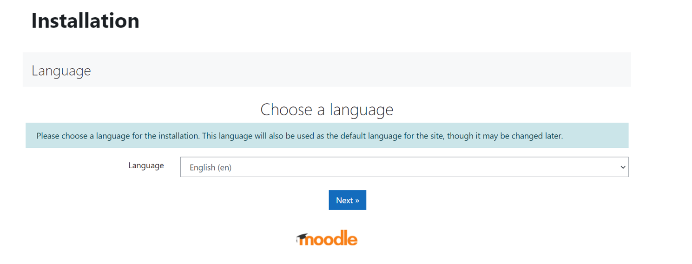
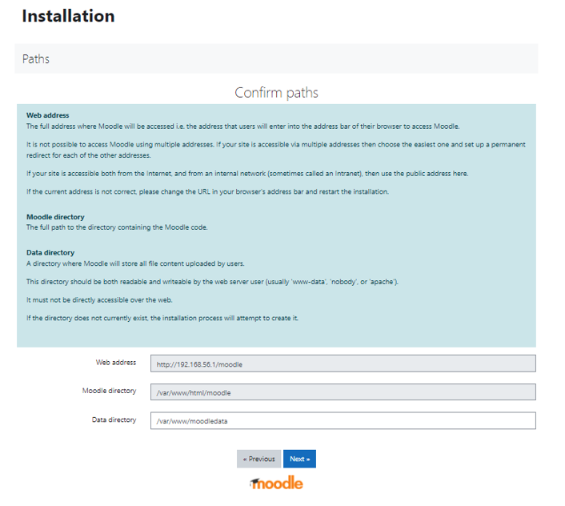
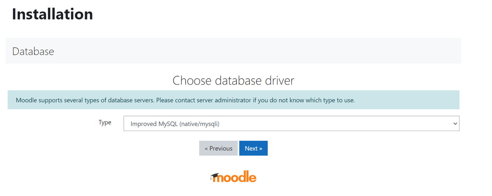
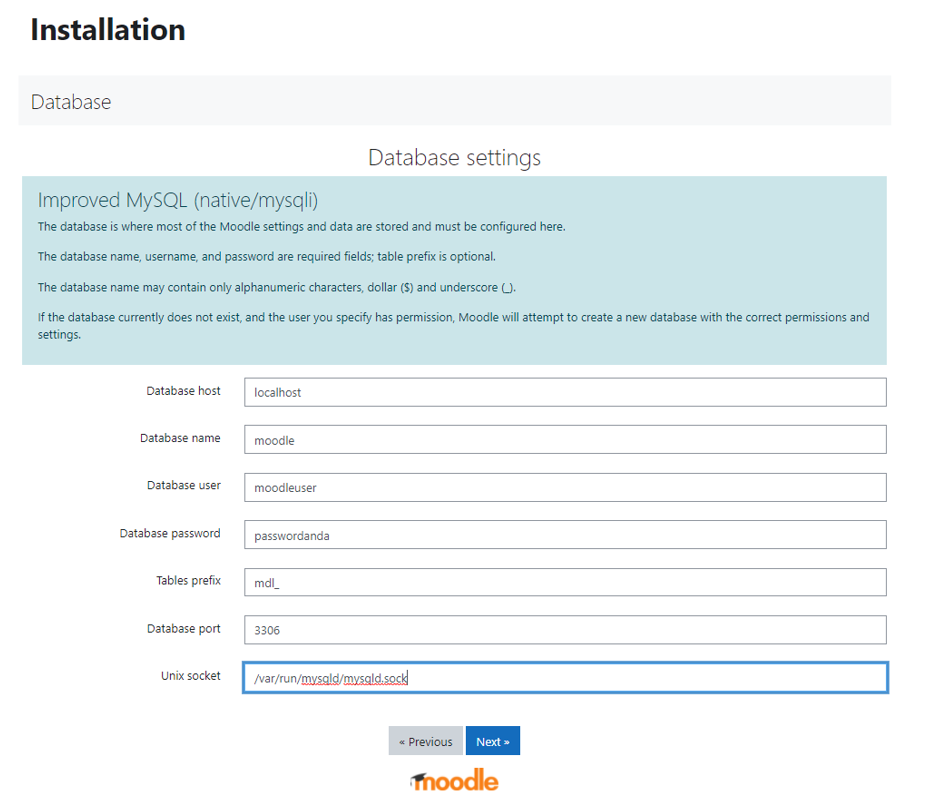
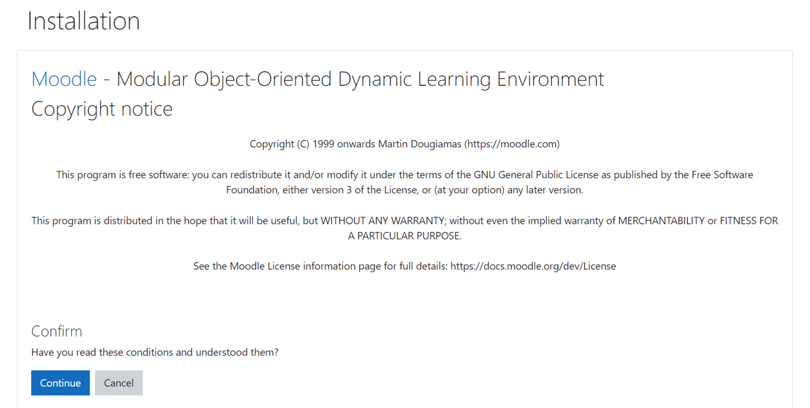
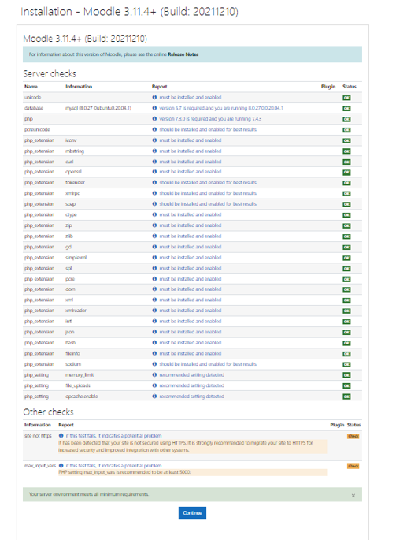
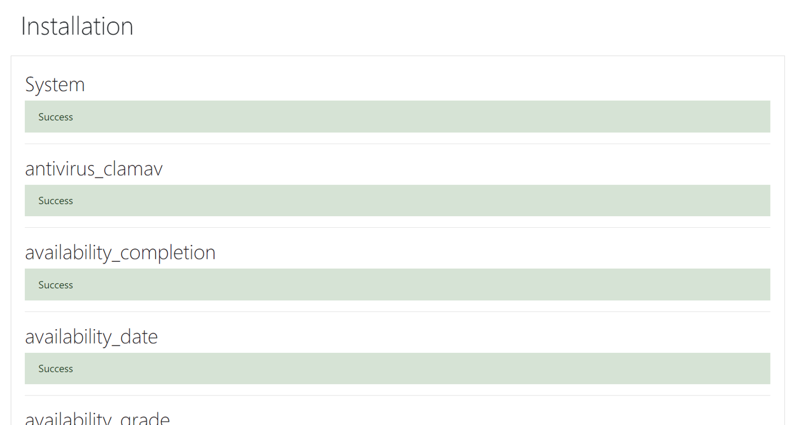
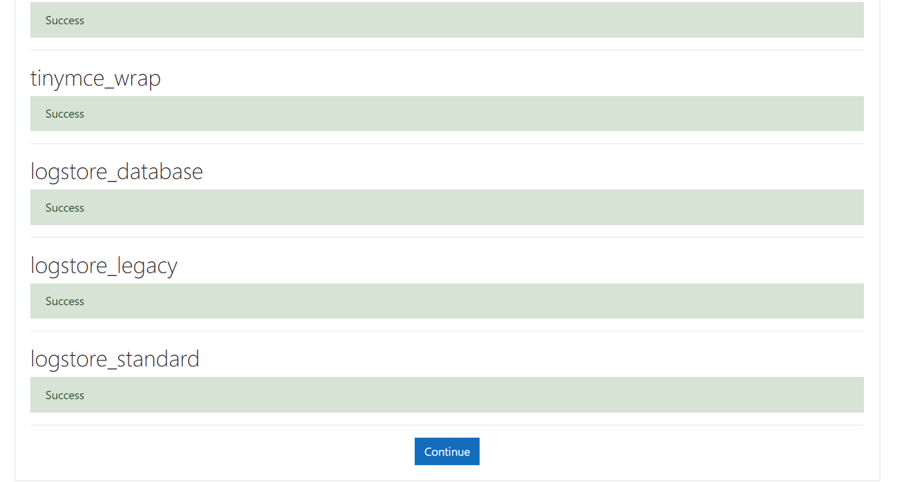
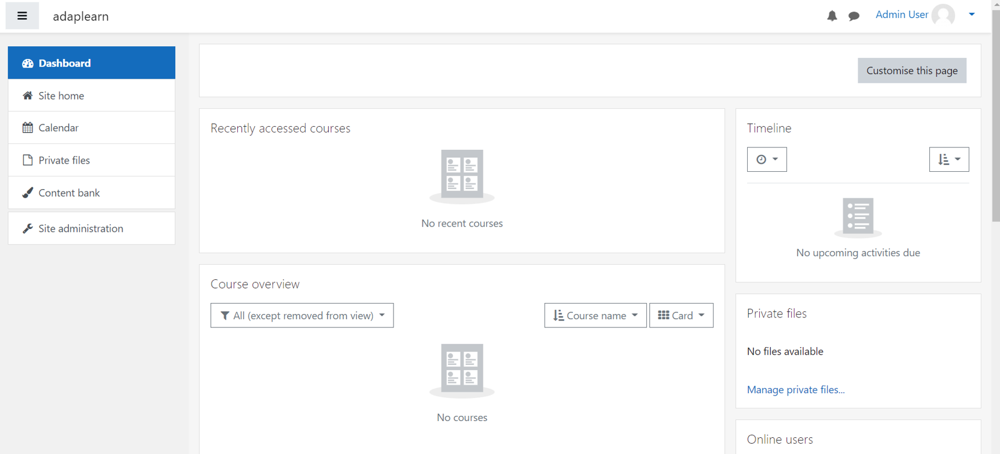

# *Instalasi CMS ( Moodle )*

**Install LAMP ( Linux Apache MySQL PHP)**

**our version**
```bash
Apache2 ( 2.4.41 )
MySQL ( 8.0.27 )
PHP ( 7.4.3 )
Moodle ( 3.11 )
```
---
## Install Web Server
```bash
sudo apt-get install apache2 -y 

sudo systemctl status apache2
```
---
## Install MySQL
```bash
sudo apt-get install mysql-server -y

sudo systemctl status mysql
```
### Check mysql sudah berjalan
```bash
sudo mysql -u root -p

<mysql> exit
```
### Buat database, user, dan hak akses user ke database
```bash
sudo mysql -u root -p

<mysql> CREATE DATABASE moodle DEFAULT CHARACTER SET utf8mb4 COLLATE utf8mb4_unicode_ci;

<mysql> CREATE USER 'moodleuser'@'localhost' IDENTIFIED BY 'passwordanda';

<mysql> GRANT SELECT,INSERT,UPDATE,DELETE,CREATE,CREATE TEMPORARY TABLES,DROP,INDEX,ALTER ON moodle.* TO moodleuser@localhost;

<mysql> FLUSH PRIVILEGES;

<mysql> exit
```
---
## Install PHP
### Install ekstensi dan library php yang dibutuhkan oleh moodle
```bash
sudo apt install php php-common php-pspell php-curl php-gd php-intl php-mysql php-xml php-xmlrpc php-ldap php-zip php-soap php-mbstring libapache2-mod-php -y
```
---
## Install PHPMyAdmin
```bash
sudo apt-get install phpmyadmin

sudo ln -s /usr/share/phpmyadmin /var/www/html/phpmyadmin
```
### Akses phpmyadmin
```bash
http://$ip/phpmyadmin
```
---
## Restart web server
```bash
service apache2 restart
```
---
## Download Moodle
 ```bash
cd /var/www/html

sudo wget --no-check-certificate 'https://docs.google.com/uc?export=download&id=1tHsN_hQ0TKdumkV_7UjRBiur_nXl2We8' -O moodle.tgz
```

### Ekstrak File 
```bash
sudo tar -xvzf moodle.tgz
 ```

### Ganti kepemilikan dan hak akses folder moodle

```bash
sudo chown -R www-data:www-data /var/www/html/moodle

sudo chmod -R 755 /var/www/html/moodle
```

### Buat folder moodledata serta ganti kepemilikan dan hak akses folder moodledata

```bash
sudo mkdir /var/www/moodledata

sudo chmod -R 755 /var/www/moodledata/

sudo chown -R www-data:www-data /var/www/moodledata
```
---
## Akses web untuk instalasi moodle
```bash
http://IP_ubuntu/moodle
```

### Bagian Cofirm Paths
Pastikan data direktori /var/www/moodledata

### Bagian Database Driver
Pilih mysql

### Bagian Database Setting
```bash
Database host : localhost

Masukkan database user : moodleuser

Masukkan password dari moodleuser : passwordanda

Isi Database port dengan port : 3306

Isi unix socket dengan : /var/run/mysqld/mysqld.sock
```

### Bagian Confirm

Pilih Continue

### Bagian Server Checks
Pastikan module-module yang penting statusnya ok dan terdapat keterangan "Your server environment meets all minimum requirements.”


Tunggu proses instalasi



### Configure Administrator Account
Isikan konfigurasi akun admin sesuai yang diperlukan saja

### New settings - Front page settings
Beri nama website e-learning moodlenya.

Instalasi Selesai !!!

## Praktik
- admin membuat course
- admin membuat 2 user
- admin enroll 2 user tersebut ke course yang telah dibuat
- admin menambahkan konten course
- salah satu user login dan mengakses course yang telah dibuat


